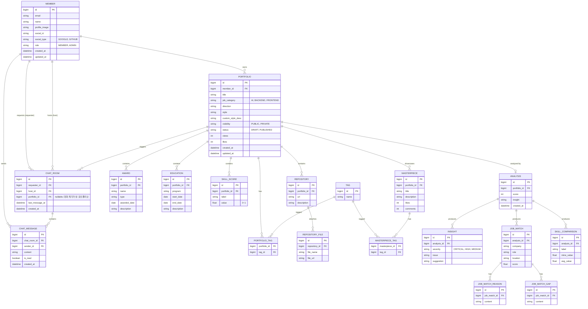

# Cupoli (TMI) ERD

> **작성 기준**: 2026-07-01 시점 `TMI-BACKEND`(`Member` 엔티티) + `TMI-FRONTEND`(types/api/ARCHITECTURE.md) 코드 분석
> **서비스 개요**: GitHub 레포·수상·교육 이력을 입력받아 포트폴리오를 생성하고, AI가 스킬 분석·직무 매칭·피드백을 제공하며, 포트폴리오를 매개로 커피챗(1:1 채팅)을 연결하는 서비스

## 현재 구현 상태

- `TMI-BACKEND`에는 `Member` 엔티티만 구현되어 있음 (`member/domain/Member.java`, `Role`, `SocialType`).
- 그 외 엔티티(포트폴리오, 분석, 채팅 등)는 아직 백엔드에 없고, `TMI-FRONTEND`의 타입 정의(`src/types/*.ts`)와 API 스켈레톤(`src/api/*.ts`)에만 도메인 모델이 드러나 있음.
- 아래 ERD는 이 두 레포의 코드를 종합해 백엔드 구현 시 참고할 목표 스키마로 설계한 것.

## ERD

## 설계 근거 (코드 매핑)

| 테이블 | 근거 코드 |
|---|---|
| `MEMBER` | `TMI-BACKEND` `Member.java`, `Role.java`, `SocialType.java` — 실제 구현된 유일한 엔티티 |
| `PORTFOLIO` | `types/portfolio.ts`의 `PortfolioCard`/`PortfolioListItem`, `portfolioApi.ts`(`/portfolios` CRUD), `builderStore.ts`의 direction/tags/style/visibility |
| `REPOSITORY`, `REPOSITORY_FILE` | `builderStore.ts`의 `RepoEntry { url, description, files: File[] }` (Step1 GitHub 연동) |
| `AWARD`, `EDUCATION` | `builderStore.ts` CRUD, `AwardsSection.tsx`, `EducationSection.tsx` |
| `SKILL_SCORE` | `types/portfolio.ts`의 `SkillScore`, `SkillRadarChart.tsx` |
| `MASTERPIECE`(+태그) | `types/portfolio.ts`의 `Masterpiece`, `MasterpieceCard.tsx` |
| `ANALYSIS`, `INSIGHT` | `analysisApi.ts`(`GET /analysis/:id`, `/feedback`), `types/analysis.ts`의 `InsightCard`, `ImprovementInsightCard.tsx` |
| `JOB_MATCH`(+reason/gap) | `analysisApi.ts`(`GET /analysis/:id/matching`), `types/analysis.ts`의 `MatchJob{reasons[], gaps[]}`, `MatchingResultCard.tsx` |
| `SKILL_COMPARISON` | `types/analysis.ts`의 `SkillComparison`, `SkillAnalysisChart.tsx` |
| `CHAT_ROOM`, `CHAT_MESSAGE` | `chatApi.ts`(`/chat/rooms`), `types/chat.ts`의 `ChatRoom`/`ChatMessage`, `RequestCoffeeChatButton.tsx` |

## 참고할 점

- **`matchScore`**(Member/Portfolio/ChatRoom UI에 보이는 값)는 별도 테이블 없이 AI 분석 결과(`ANALYSIS`/`JOB_MATCH`)를 조회 시점에 계산하거나 캐시 컬럼으로 두는 것을 권장. 매 요청마다 계산 비용이 크면 `PORTFOLIO.cached_match_score` 같은 비정규화 컬럼을 고려.
- **`reasons[]`/`gaps[]`**는 정규화된 자식 테이블로 설계했지만, 검색/조인이 필요 없다면 JSON 컬럼(`jsonb` 등)으로 단순화해도 무방.
- **`views`/`likes`**는 프론트 mock에서 문자열(`"1.2k"`)로 다뤄지지만, DB에는 정수로 저장하고 프레젠테이션 레이어에서 포맷팅하는 것을 권장.
- 백엔드 구현 시 `member` 패키지 구조를 그대로 따라 `portfolio`, `analysis`, `chat` 도메인 패키지로 확장 (`domain` / `repository` / `service` / `presentation` / `dto`).
